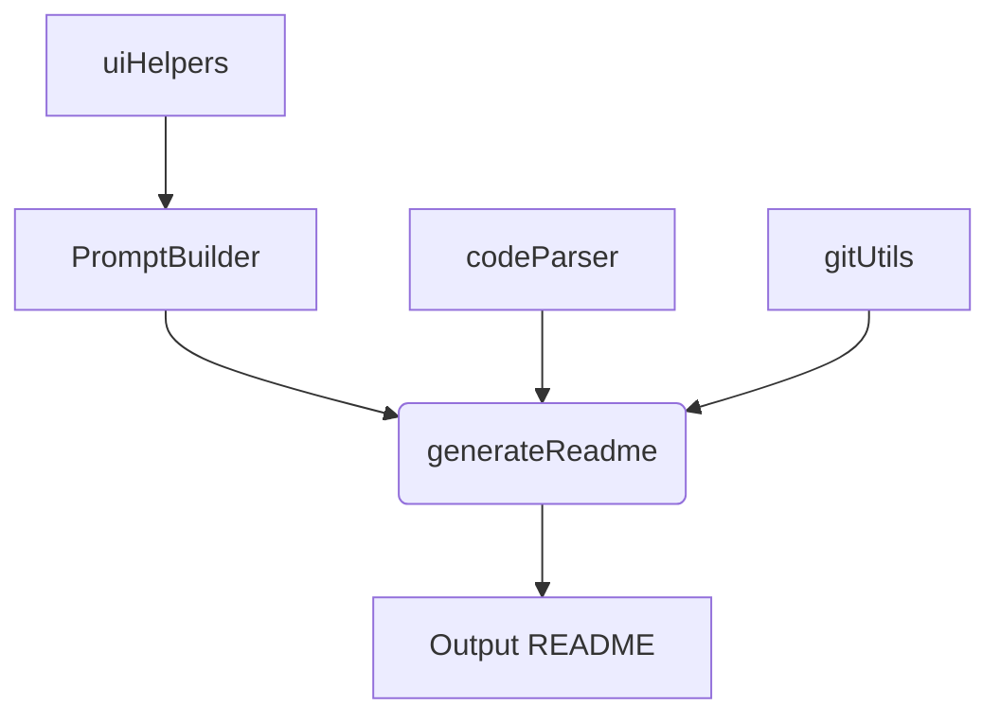
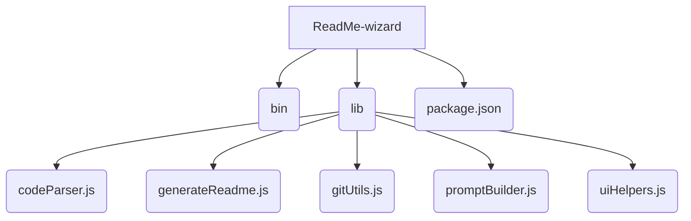

# ReadMe-wizard

> A command-line tool to generate README files using interactive prompts and code analysis.

## Table of Contents

- [Description](#description)
- [Tech Stack](#tech-stack)
- [Architecture Overview](#architecture-overview)
- [File Structure](#file-structure)
- [Features](#features)
- [Installation](#installation)
- [Usage](#usage)
- [Contributors](#contributors)
- [License](#license)


## Description

ReadMe-wizard is a command-line tool built with Node.js that simplifies the creation of comprehensive README files.  It leverages interactive prompts to gather project information and analyzes your codebase to automatically generate sections such as project description and file structure. This tool streamlines the README creation process, ensuring consistent and informative documentation for your projects. The primary use case is automating the generation of high-quality README files, offering significant time savings for developers.  The unique value proposition lies in its combination of interactive prompts and code parsing capabilities to produce detailed and accurate README content.  The `make-readme` CLI command, defined in the `package.json`, provides the primary entry point to the application. Functions like `generateReadme` and `parseCode` play crucial roles in this process.

## Tech Stack

[](https://nodejs.org/) [](https://www.npmjs.com/package/inquirer) [](https://www.npmjs.com/package/chalk) [](https://www.npmjs.com/package/figlet) [](https://www.npmjs.com/package/fs-extra) [](https://www.npmjs.com/package/globby) [](https://www.npmjs.com/package/ora) [](https://www.npmjs.com/package/prompts) [](https://www.npmjs.com/package/simple-git) [](https://www.npmjs.com/package/tree-sitter) [](https://developers.generativeai.google/) [](https://github.com/PIYUSH1SAINI/ReadMe-wizard.git)


## Architecture Overview



## File Structure



## Features

*   **Interactive Prompts:** Guides users through a series of prompts to gather essential project details.
*   **Code Analysis:** Parses project files to automatically extract information about the codebase.
*   **Git Integration:** Retrieves information about the project's Git repository, including contributors.
*   **README Generation:** Dynamically generates a comprehensive README file based on gathered information.
*   **Customizable Output:** Allows users to tailor the generated README to their specific needs.
*   **Cross-Platform Compatibility:** Works seamlessly across different operating systems.


## Installation

### Prerequisites

*   Node.js >=14

### Setup

```bash
git clone https://github.com/PIYUSH1SAINI/ReadMe-wizard.git
cd ReadMe-wizard
npm install
```

### Installation Options

#### Production (Global)

```bash
npm install -g .
```

#### Development (Local)

```bash
npm link
```

## Usage

### Execution Options

#### Run Locally

```bash
node bin/index.js
```

#### Run Globally

```bash
make-readme
```


## Contributors

<a href="https://github.com/PIYUSH1SAINI" target="_blank"></a>


## License

MIT License


<a href="https://github.com/PIYUSH1SAINI/ReadMe-wizard.git" target="_blank">
      
    </a>
