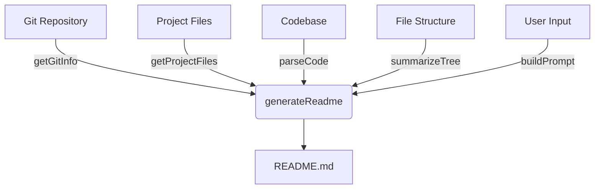
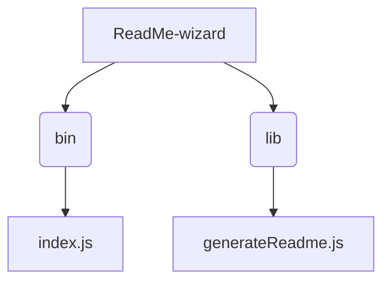

# ReadMe-wizard

> A CLI tool to automatically generate professional README files for software projects.

## Description

ReadMe-wizard is a command-line tool designed to streamline the creation of high-quality README files.  It automates the process of gathering project information, analyzing code structure, and generating a well-formatted README.md file. This saves developers valuable time and ensures consistency across projects. The core functionality is built around several key functions within `lib/generateReadme.js`: `getGitInfo` retrieves project metadata from Git, `getProjectFiles` lists project files, `parseCode` analyzes code for function and class definitions, `summarizeTree` simplifies the project file structure, `buildPrompt` constructs a user-friendly interface for customization options and `generateReadme` compiles all gathered information into a polished README.md file.

## Architecture Overview

## File Structure

## Features

* **Automated README Generation:** Creates a comprehensive README.md file based on project metadata and code analysis.
* **Git Integration:** Extracts project information (author, description, etc.) directly from the Git repository.
* **Code Analysis:** Parses code to identify key functions, classes, and modules, providing insights into project structure.
* **File Structure Summarization:** Presents a clear overview of the project's file hierarchy, simplifying understanding.
* **Customizable Output:** Allows users to tailor the generated README content via a user-friendly prompt.
* **Professional Formatting:** Generates a README.md file that adheres to best practices for readability and clarity.

## Installation

1. Clone the repository: `git clone <repository_url>`
2. Navigate to the project directory: `cd ReadMe-wizard`
3. Install dependencies: `npm install`

## Usage

1. Run the ReadMe-wizard: `node bin/index.js`
2. Follow the on-screen prompts to provide any necessary project information or customize the generated README.

## Scripts

* `npm install`: Installs project dependencies.
* `node bin/index.js`: Runs the ReadMe-wizard to generate a README file.

## Contributing

We welcome contributions! Please open an issue to report bugs or suggest features.  Pull requests are also welcome.

## License

MIT License

## Credits

Author: PIYUSH1SAINI

This project utilizes Node.js and npm.

  

  