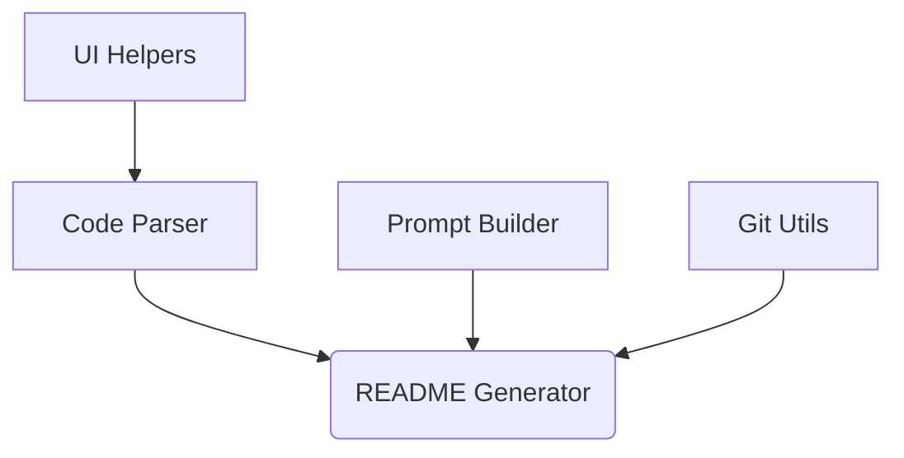
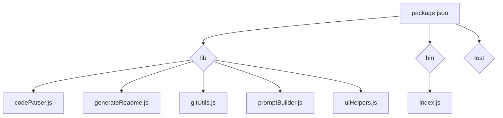

# ReadMe-wiz

> A command-line tool to generate README files for software projects, analyzing code and leveraging AI.

## 📚 Table of Contents

- [Description](#description)
- [Installation](#installation)
  - [Prerequisites](#prerequisites)
  - [Setup](#setup)
- [Usage](#usage)
  - [Execution Options](#execution-options)
- [Tech Stack](#tech-stack)
- [Architecture Overview](#architecture-overview)
- [File Structure](#file-structure)
- [Features](#features)
- [Testing](#testing)
- [Contributing](#contributing)
- [Contributors](#contributors)
- [License](#license)

## Description

ReadMe-wiz is a command-line tool built with Node.js that simplifies the process of creating professional README files for software projects. It leverages AI to generate comprehensive documentation by analyzing your project's codebase, including various programming languages, HTML, CSS, and Vue.js components. Using the `make-readme` command, developers can quickly generate a high-quality README file, saving time and ensuring consistency across projects. The core functionality relies on parsing the project files to extract key information and then utilizes AI to structure and generate the README content. The `validateGeminiApiKey` function, for instance, ensures secure API usage.


## Installation

### Prerequisites

- Node.js >=14

### Setup

1.  Install via npm:
    ```bash
    npm install -g readme-wiz
    ```

2.  You can then use the `make-readme` command as described in the Usage section.


## Usage

### Execution Options

#### Global CLI

To generate a README file for your project, run:

```bash
make-readme
```

This command will create or update a README file in the current directory.

The following options are available:

1. **`make-readme`**: This command creates a new README file using default settings. If a README already exists, it will overwrite it.

2. **`make-readme --new`**: This command creates a completely new README file. If a README already exists, it will be overwritten.

3. **`make-readme --new "some user requests"`**: This command creates a new README file incorporating the specified user requests. The requests should be a description of the desired content for the README. If a README already exists, it will be overwritten.

4. **`make-readme "some user requests"`**: This command updates an existing README file with the specified user requests. The requests should be a description of the desired content changes for the README. If no README file exists, a new one will be created.

## Tech Stack

[](https://nodejs.org/) [](https://www.javascript.com/) [](https://www.typescriptlang.org/) [](https://www.cplusplus.com/) [](https://learn.microsoft.com/en-us/dotnet/csharp/) [](https://go.dev/) [](https://html.spec.whatwg.org/) [](https://www.w3.org/Style/CSS/) [](https://www.php.net/) [](https://www.python.org/) [](https://www.ruby-lang.org/en/) [](https://www.rust-lang.org/) [](https://vuejs.org/) [](https://github.com/PIYUSH1SAINI/ReadMe-wiz.git)

## Architecture Overview



## File Structure



## Features

- Parses code from various languages (C++, C#, Go, HTML, Java, JavaScript, JSX, PHP, Python, Ruby, Rust, TypeScript, TSX, Vue.js) to extract relevant information.
- Generates a structured README.md file including sections like Description, Tech Stack, and Installation.
- Utilizes AI for enhanced content generation and improved readability.
- Supports Git integration to extract contributor information.
- Provides a user-friendly command-line interface (`make-readme`).
- Includes API key validation for secure usage.

## Testing

This project includes a test suite for the multilanguage feature. The tests are located in the `test` folder. To run the tests, execute the following command:

```bash
node runParserTests.js
```

## Contributing

Contributions are welcome! Please open an issue or submit a pull request.

## Contributors

<a href="https://github.com/PIYUSH1SAINI" target="_blank"></a>

## License

MIT License

<a href="https://github.com/PIYUSH1SAINI/ReadMe-wiz.git" target="_blank">
      
    </a>
