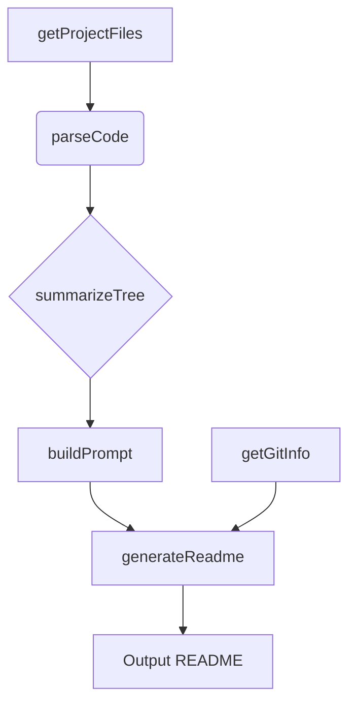
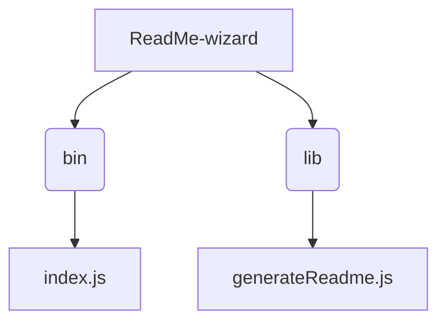

# ReadMe-wizard

> A Node.js tool for generating professional, user-friendly README files.  Simplify your documentation workflow!

## Description

ReadMe-wizard is a command-line tool built with Node.js that automates the creation of high-quality README files for software projects.  It leverages information extracted directly from your project's codebase and file structure to produce a comprehensive and well-organized README. This tool streamlines the documentation process, ensuring consistency and saving developers valuable time.  The core functionality relies on several key functions within `lib/generateReadme.js`: `getGitInfo`, `getProjectFiles`, `parseCode`, `summarizeTree`, `buildPrompt`, `generateReadme`, and `callGemini` (which likely interacts with an external service for additional information).

## Architecture Overview



## File Structure



## Features

* **Automated README Generation:**  Creates a structured README file based on project details.
* **Code Analysis:** Parses your code to extract key information for inclusion in the README.
* **File Structure Visualization:**  Generates a representation of your project's directory layout.
* **Git Integration:**  Pulls relevant information from your Git repository (e.g., author, description).
* **Customizable Output:** Allows for tailoring the generated README to your specific needs.
* **External API Integration (likely):**  The `callGemini` function suggests potential interaction with an external service for enhanced content generation.

## Installation

Before starting, ensure you have Node.js and npm (or yarn) installed on your system.

```bash
# Clone the repository
git clone https://github.com/[your_username]/ReadMe-wizard.git

# Navigate to the project directory
cd ReadMe-wizard

# Install dependencies
npm install
```

## Usage

To generate a README, simply run the following command from the project's root directory:

```bash
node bin/index.js
```

This will generate a README.md file in the current directory.  Further options might be added in future versions to allow customization of the generated output.

## Scripts

* `npm install`: Installs project dependencies.
* `node bin/index.js`: Runs the ReadMe-wizard to generate a README file.


## Contributing

We welcome contributions to ReadMe-wizard! Please open an issue to report bugs or suggest features.  Pull requests are also welcome; follow standard Git best practices.

## License

MIT License

This software is licensed under the MIT License. See the `LICENSE` file for details.

## Credits

* **Author:** PIYUSH1SAINI
* **Dependencies:** Node.js, npm (or yarn)


<a href="https://github.com/PIYUSH1SAINI/ReadMe-wizard.git" target="_blank">

</a>

    