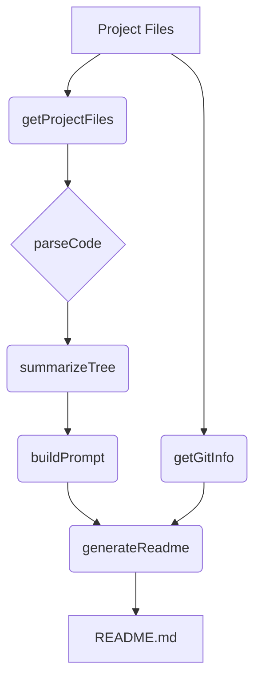
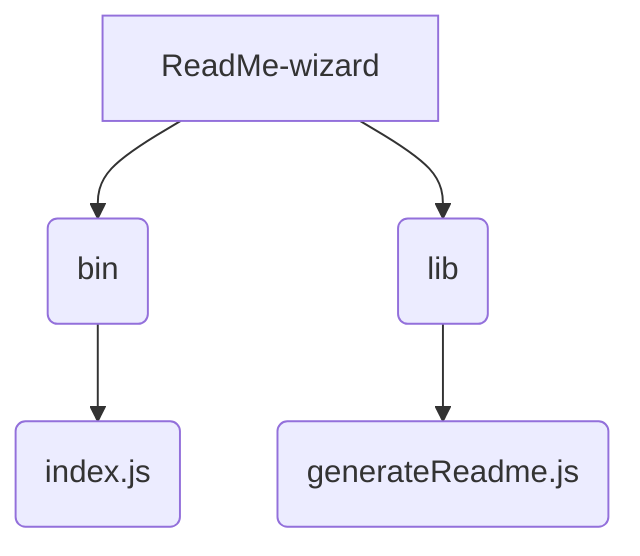

# ReadMe-wizard

> A command-line tool to generate professional README files for software projects.  Simplify your documentation workflow and create consistent, high-quality READMEs.

## Description

ReadMe-wizard is a powerful command-line tool designed to streamline the creation of professional README files for software projects.  It leverages information extracted from your project's codebase and structure to automatically generate a comprehensive and well-formatted README. This tool utilizes key functions like `getGitInfo` to gather project metadata, `getProjectFiles` to analyze the file structure, `parseCode` to identify key functions and classes within your code, `summarizeTree` to present this information concisely,  `buildPrompt` to curate necessary inputs, and `generateReadme` to assemble the final README document. This simplifies the documentation process, freeing developers to focus on code.

## Architecture Overview



## File Structure



## Features

* **Automated README Generation:**  Automatically creates a structured and well-formatted README file.
* **Codebase Analysis:** Analyzes your project's code to extract key information for inclusion in the README.
* **Git Integration:**  Retrieves project metadata (e.g., description, author) from your Git repository.
* **Customizable Output:**  Allows for customization of the generated README's content and style.
* **Clear Structure:** Organizes README content into logical sections for improved readability.
* **Efficient Workflow:**  Reduces time and effort spent on manual README creation.


## Installation

1. Clone the repository:
   ```bash
   git clone https://github.com/[your-github-username]/ReadMe-wizard.git
   cd ReadMe-wizard
   ```
2. Install dependencies:
   ```bash
   npm install
   ```

## Usage

1. Navigate to the project directory.
2. Run the ReadMe-wizard:
   ```bash
   node bin/index.js
   ```
   The tool will prompt for necessary information and generate the README.md file in the current directory.


## Scripts

* `npm start`: Runs the ReadMe-wizard.

## Contributing

Contributions are welcome! Please submit pull requests or create issues on GitHub.

## License

MIT License

## Credits

PIYUSH1SAINI


  

<a href="https://github.com/PIYUSH1SAINI/ReadMe-wizard.git" target="_blank">
  
  </a>

  