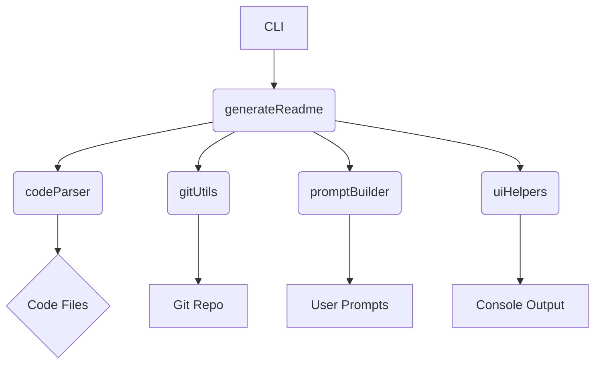
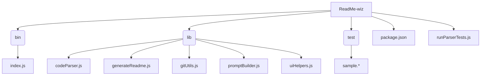

# ReadMe-wiz

> A command-line tool to generate README files for software projects, leveraging code analysis and Git information.

## 📚 Table of Contents

- [Description](#description)
- [Tech Stack](#tech-stack)
- [Architecture Overview](#architecture-overview)
- [File Structure](#file-structure)
- [Features](#features)
- [Installation](#installation)
  - [Prerequisites](#prerequisites)
  - [Setup](#setup)
- [Usage](#usage)
  - [Execution Options](#execution-options)
- [Contributing](#contributing)
- [Contributors](#contributors)
- [License](#license)

## Description

ReadMe-wiz is a command-line tool built with Node.js that automates the creation of professional README files for software projects. It analyzes your project's codebase, extracts relevant information from your Git repository, and uses this data to generate a comprehensive and well-structured README.md file. This streamlines the documentation process, ensuring consistent and informative documentation for all your projects. The core functionality relies on parsing various programming languages (including C++, C#, CSS, Go, HTML, Java, JavaScript, JSX, PHP, Python, Ruby, Rust, TypeScript, and Vue.js) to extract key structural elements like functions, classes, and methods. The `generateReadme` function in `lib/generateReadme.js` orchestrates the process, utilizing other modules like `codeParser` for code analysis and `gitUtils` for Git information retrieval. The `make-readme` command, defined in `package.json`, provides a convenient CLI interface for users.

## Tech Stack

[](https://nodejs.org/) [](https://www.javascript.com/) [](https://www.typescriptlang.org/) [](https://www.npmjs.com/package/inquirer) [](https://www.npmjs.com/package/chalk) [](https://github.com/tree-sitter/tree-sitter) [](https://isocpp.org/) [](https://learn.microsoft.com/en-us/dotnet/csharp/) [](https://www.w3.org/Style/CSS/) [](https://go.dev/) [](https://html.spec.whatwg.org/) [](https://www.java.com/en/) [](https://www.php.net/) [](https://www.python.org/) [](https://www.ruby-lang.org/en/) [](https://www.rust-lang.org/) [](https://vuejs.org/) [](https://github.com/PIYUSH1SAINI/ReadMe-wiz.git)

## Architecture Overview



## File Structure



## Features

- **Automated README Generation:** Creates a comprehensive README.md file based on code and Git information.
- **Multi-Language Support:** Parses code from various programming languages (C++, C#, CSS, Go, HTML, Java, JavaScript, JSX, PHP, Python, Ruby, Rust, TypeScript, Vue.js).
- **Git Integration:** Extracts contributor information and repository details from your Git history.
- **Interactive Prompts:** Guides users through the process with clear prompts for customization.
- **Customizable Output:** Allows for tailoring the generated README to specific project requirements.
- **Command-Line Interface:** Provides a simple and efficient way to generate READMEs via the `make-readme` command.

## Installation

### Prerequisites

> [!NOTE]
> Node.js >=14 and npm are required for ReadMe-wiz. Ensure you have these installed before proceeding.

### Setup

1. **Global CLI Installation**

   ```bash
   npm install -g readme-wiz
   ```

2. **Clone Repository**
   ```bash
   git clone https://github.com/PIYUSH1SAINI/ReadMe-wiz.git
   cd ReadMe-wiz
   npm install
   ```

> [!TIP]
> Use `npm install -g readme-wiz` for the quickest setup.

## Usage

### Execution Options

> [!IMPORTANT]
> Ensure that you have a project directory with code files and a `.git` repository before running ReadMe-wiz.

#### Global CLI Execution

To generate a README.md file, navigate to your project's root directory and run:

```bash
make-readme
```

This command will create or update a README file in the current directory.

The following options are available:

1. **`make-readme`**: This command creates a new README file using default settings. If a README already exists, it will overwrite it.

2. **`make-readme --new`**: This command creates a completely new README file. If a README already exists, it will be overwritten.

3. **`make-readme --new "some user requests"`**: This command creates a new README file incorporating the specified user requests. The requests should be a description of the desired content for the README. If a README already exists, it will be overwritten.

4. **`make-readme "some user requests"`**: This command updates an existing README file with the specified user requests. The requests should be a description of the desired content changes for the README. If no README file exists, a new one will be created.

## Testing

This project includes a test suite for the multilanguage feature. The tests are located in the `test` folder. To run the tests, execute the following command:

```bash
node runParserTests.js
```

## Contributing

Contributions are welcome! Please open an issue or submit a pull request on GitHub.

## Contributors

<a href="https://github.com/PIYUSH1SAINI" target="_blank"></a>

## License

MIT License

<a href="https://github.com/PIYUSH1SAINI/ReadMe-wiz.git" target="_blank">
      
    </a>
