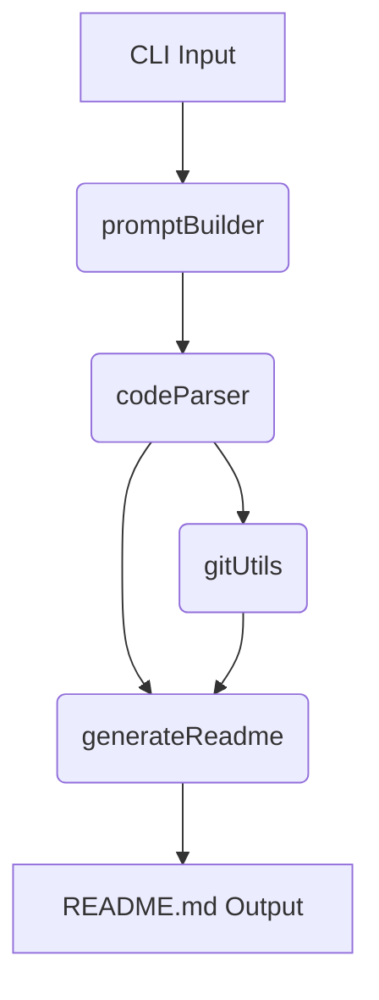
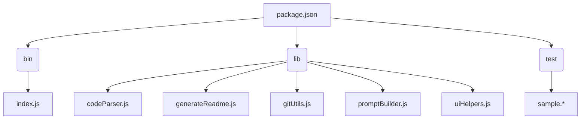

# ReadMe-wizard

> A command-line tool to generate README files for your projects.  Utilizes code analysis and AI assistance for comprehensive documentation.


## 📚 Table of Contents

- [Description](#description)
- [Tech Stack](#tech-stack)
- [Architecture Overview](#architecture-overview)
- [File Structure](#file-structure)
- [Features](#features)
- [Installation](#installation)
  - [Prerequisites](#prerequisites)
  - [Setup](#setup)
- [Usage](#usage)
  - [Execution Options](#execution-options)
- [Contributing](#contributing)
- [Contributors](#contributors)
- [License](#license)


## Description

ReadMe-wizard is a command-line tool built using Node.js that automates the creation of comprehensive README files for software projects.  It leverages code analysis to extract key information from your project's source code and utilizes AI to generate informative descriptions and summaries. The primary use case is to simplify and expedite the README creation process, enhancing project documentation quality and reducing manual effort. The tool's unique value proposition lies in its ability to parse various programming languages and generate detailed documentation, including sections on features, installation, and usage. The `make-readme` command from the `bin` entry in `package.json` executes the core functionality.  Key functions like `generateReadme`, `parseCode`, and `buildPrompt` contribute to the automation process.


## Tech Stack

[](https://nodejs.org/)
[](https://www.npmjs.com/package/inquirer)
[](https://www.npmjs.com/package/chalk)
[](https://github.com/tree-sitter/tree-sitter)
[](https://github.com/steveukx/git-js)
[](https://cloud.google.com/generative-ai)
[](https://github.com/PIYUSH1SAINI/ReadMe-wizard.git)


## Architecture Overview



## File Structure



## Features

*   Parses various programming languages (C++, C#, CSS, Go, HTML, Java, Javascript, JSX, PHP, Python, Ruby, Rust, Typescript, TSX, Vue) to extract code information.
*   Generates a structured README.md file including sections for Description, Tech Stack, Installation, Usage, and Contributing.
*   Uses Git integration to extract contributor information and commit history.
*   Provides a customizable prompt-based interface for user input.
*   Supports both simple and detailed README generation.
*   Integrates with Google's Generative AI for enhanced content generation (with API key).

## Installation

### Prerequisites

*   Node.js >=14

### Setup

1.  Clone the repository:
    ```bash
    git clone https://github.com/PIYUSH1SAINI/ReadMe-wizard.git
    ```
2.  Navigate to the project directory:
    ```bash
    cd ReadMe-wizard
    ```
3.  Install dependencies:
    ```bash
    npm install
    ```


## Usage

### Execution Options

The primary command is `make-readme`.  A second command allows for a custom user request to be appended to the `make-readme` command. For example:


```bash
make-readme "Add a section on supported languages"
```

This will generate the README file with additional information based on the specified request.


```bash
make-readme
```

This will generate the README file using default settings.


## Contributing

Contributions are welcome! Please open an issue or submit a pull request.


## Contributors

<a href="https://github.com/PIYUSH1SAINI" target="_blank"></a>


## License

MIT License


<a href="https://github.com/PIYUSH1SAINI/ReadMe-wizard.git" target="_blank">
      
    </a>
