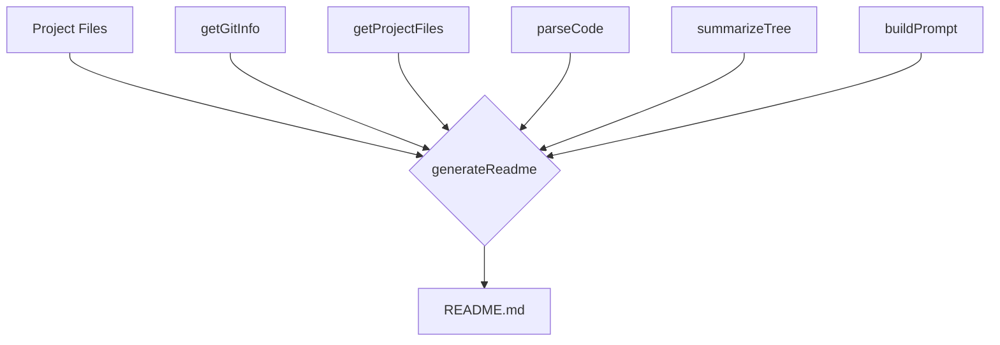
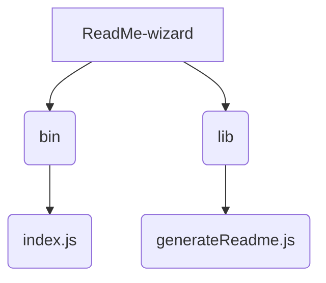

# ReadMe-wizard

> A command-line tool to generate professional README files for your projects.  Quickly create well-structured and informative READMEs with minimal effort.

## Description

ReadMe-wizard is a command-line tool designed to streamline the process of creating high-quality README files for software projects.  It leverages information about your project's files and code structure to automatically generate a comprehensive README.  The tool utilizes functions like `getGitInfo` to gather project metadata, `getProjectFiles` to analyze the file structure, `parseCode` to identify key functions and classes (such as `generateReadme`, `buildPrompt`, `summarizeTree`), and `buildPrompt` to construct a user-friendly prompt to gather additional information. The core functionality resides in `lib/generateReadme.js`, which orchestrates the process of creating the final README document.  This simplifies the README creation process, ensuring consistency and completeness across your projects.

## Architecture Overview

## File Structure

## Features

* **Automated README Generation:** Creates a structured README based on project files and code analysis.
* **Git Integration:**  Pulls relevant information from your Git repository (e.g., project description).
* **Code Analysis:** Identifies key functions and classes to highlight core functionality within the README.
* **Customizable Prompts:** Allows users to provide additional details about their project.
* **Clear Structure:** Produces a README with a consistent and easy-to-read format.
* **Modular Design:** Built using a modular approach (separate modules for different functionalities).

## Installation

1. Clone the repository: `git clone <repository_url>`
2. Navigate to the project directory: `cd ReadMe-wizard`
3. Install dependencies: `npm install`

## Usage

1. Run the tool: `node bin/index.js`
2. Follow the prompts to provide information about your project.  
3. The tool will generate a `README.md` file in the current directory.

## Scripts

* `npm start`: Runs the ReadMe-wizard.
* `npm test`: Runs tests (if any).  

## Contributing

Contributions are welcome! Please open an issue or submit a pull request.

## License

MIT License

## Credits

PIYUSH1SAINI

This project utilizes Node.js and npm.

  

  