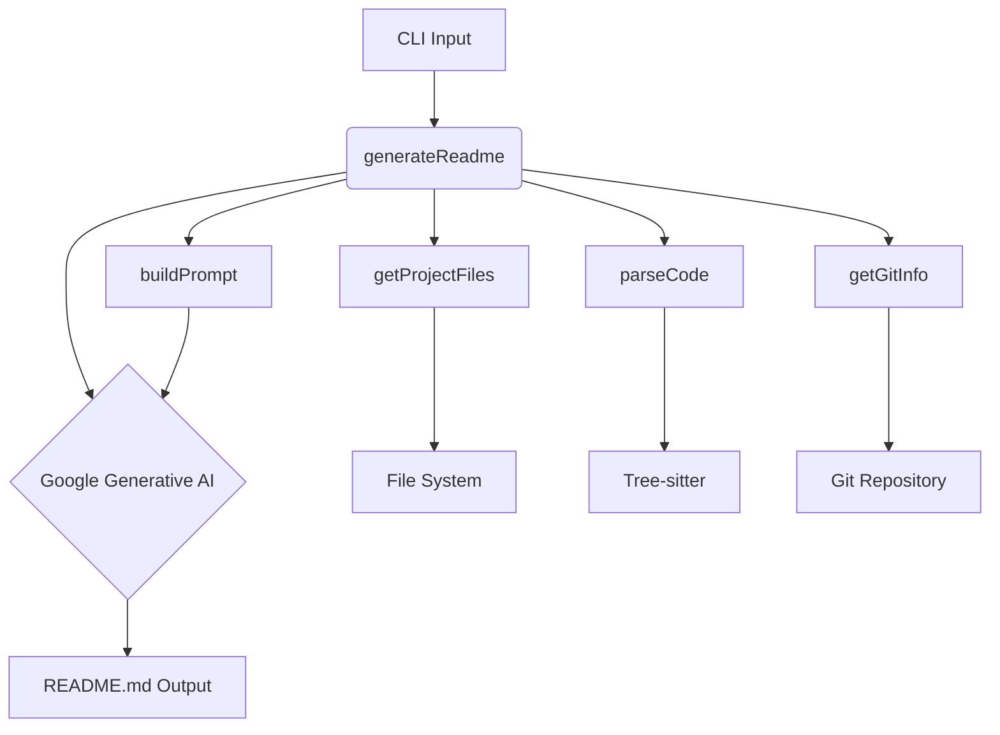
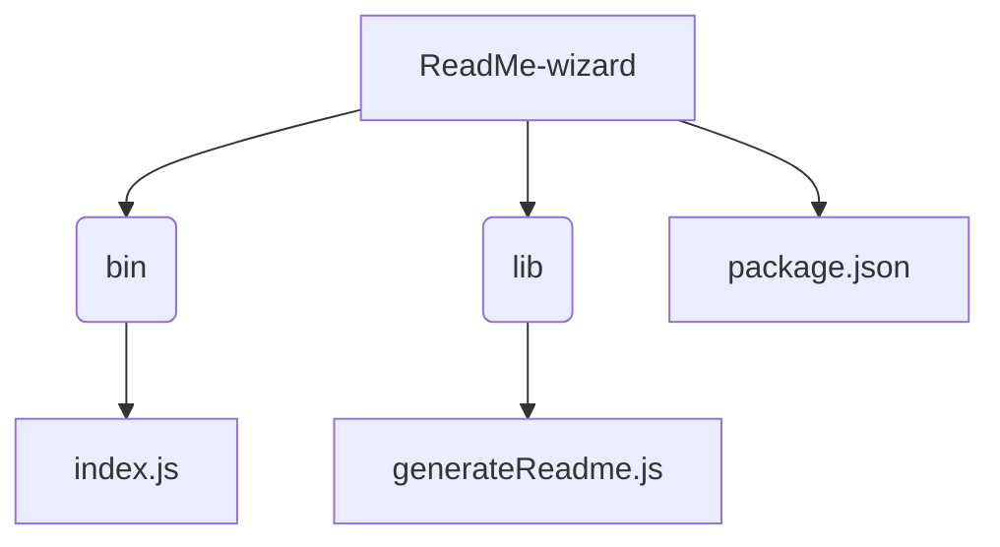

# ReadMe-wizard

> A CLI tool to generate README files using Google's Generative AI.

## Table of Contents

- [Description](#description)
- [Tech Stack](#tech-stack)
- [Architecture Overview](#architecture-overview)
- [File Structure](#file-structure)
- [Features](#features)
- [Installation](#installation)
- [Usage](#usage)
- [Contributing](#contributing)
- [License](#license)


## Description

ReadMe-wizard is a command-line interface (CLI) tool built with Node.js that leverages Google's Generative AI to automatically generate comprehensive README files for software projects.  It analyzes project files, extracts key information, and uses AI to create a well-structured and informative README. This simplifies the documentation process for developers, saving them valuable time and effort. The primary use case is automating the creation of high-quality README files, and its unique value lies in its ability to intelligently synthesize project details and generate human-readable descriptions, thanks to functions like `validateGeminiApiKey`, `getGitInfo`, `getProjectFiles`, `parseCode`, `summarizeTree`, `buildPrompt`, and the core `generateReadme` function. The `make-readme` command, defined in the `package.json`, provides a convenient way to utilize the tool.

## Tech Stack

[](https://nodejs.org/) [](https://cloud.google.com/generative-ai) [](https://github.com/chalk/chalk) [](https://github.com/SBoudrias/Inquirer.js) [](https://github.com/sindresorhus/ora) [](https://github.com/terkelg/prompts) [](https://github.com/steveukx/git-js) [](https://github.com/jprichardson/node-fs-extra) [](https://github.com/sindresorhus/globby) [](https://github.com/tree-sitter/tree-sitter) [](https://github.com/motdotd/dotenv) [](https://github.com/PIYUSH1SAINI/ReadMe-wizard.git)


## Architecture Overview



## File Structure



## Features

* **Generative AI Integration:** Leverages Google's Generative AI for intelligent README content creation.
* **Project File Analysis:** Parses project files to extract key information such as file structure, code snippets, and dependencies.
* **Git Integration:** Retrieves project information from the Git repository.
* **Customizable Prompts:** Allows for fine-tuning the generated README content through customizable prompts.
* **API Key Validation:** Ensures the provided Gemini API key is valid before proceeding.
* **CLI Interface:** Provides a user-friendly command-line interface for easy operation.

## Installation

### Prerequisites

* Node.js version >=14

```bash
node -v
```

### Setup

1. Clone the repository:

```bash
git clone https://github.com/PIYUSH1SAINI/ReadMe-wizard.git
cd ReadMe-wizard
```

2. Install dependencies:

```bash
npm install
```

### Installation Options

#### Production (Global)

```bash
npm install -g .
```

#### Development (Local)

```bash
npm link
```


## Usage

### Execution Options

#### Run Locally

```bash
node lib/generateReadme.js
```

#### Run Globally

```bash
make-readme
```


## Contributing

Contributions are welcome! Please open an issue or submit a pull request.

## License

MIT License


<a href="https://github.com/PIYUSH1SAINI/ReadMe-wizard.git" target="_blank">

</a>
