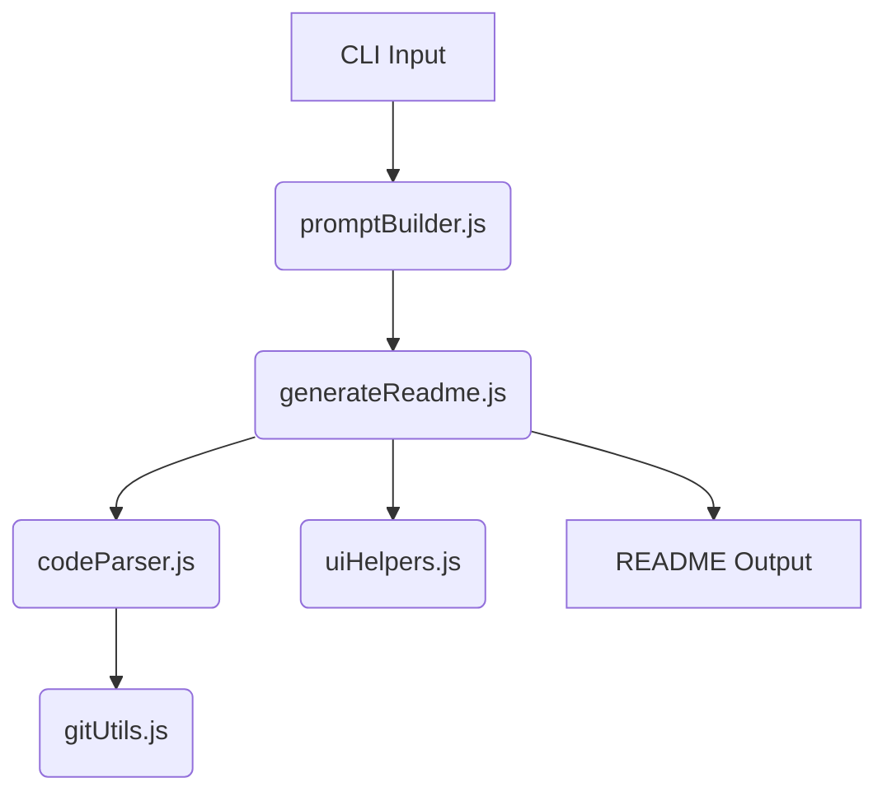
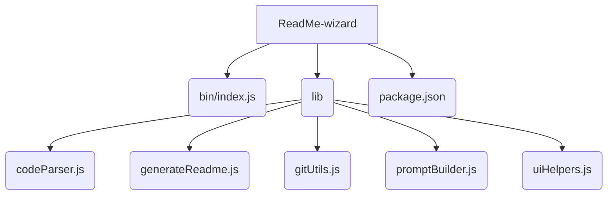

# ReadMe-wizard

> A command-line tool for generating professional README files using code analysis and AI assistance.

## Table of Contents

- [Description](#description)
- [Tech Stack](#tech-stack)
- [Architecture Overview](#architecture-overview)
- [File Structure](#file-structure)
- [Features](#features)
- [Installation](#installation)
  - [Prerequisites](#prerequisites)
  - [Setup](#setup)
- [Usage](#usage)
  - [Execution Options](#execution-options)
    - [Global CLI](#global-cli)
- [Contributors](#contributors)
- [License](#license)


## Description

ReadMe-wizard is a backend Node.js command-line application designed to automate the creation of comprehensive README files.  It leverages code analysis to understand project structure and utilizes AI to generate insightful descriptions. The primary use case is streamlining the README generation process, saving developers time and ensuring consistency.  The tool's unique value proposition lies in its ability to validate API keys and intelligently generate sections based on the codebase.  The `make-readme` command, defined in `package.json`, initiates the README generation process.


## Tech Stack

[](https://nodejs.org/)
[](https://www.npmjs.com/)
[](https://cloud.google.com/generative-ai)
[](https://github.com/SBoudrias/Inquirer.js)
[](https://github.com/chalk/chalk)
[](https://github.com/PIYUSH1SAINI/ReadMe-wizard.git)


## Architecture Overview



## File Structure



## Features

- Parses project code to extract relevant information.
- Uses AI to generate descriptive README sections.
- Interacts with Git to gather commit history and contributor data.
- Provides a user-friendly CLI experience.
- Validates Gemini API keys for AI interaction.
- Generates a well-formatted README.md file.


## Installation

### Prerequisites

- Node.js >=14

### Setup

1. Clone the repository:
   ```bash
   git clone https://github.com/PIYUSH1SAINI/ReadMe-wizard.git
   ```
2. Navigate to the project directory:
   ```bash
   cd ReadMe-wizard
   ```
3. Install dependencies:
   ```bash
   npm install
   ```

## Usage

### Execution Options

#### Global CLI

To generate a README file, run:

```bash
make-readme
```
The script will guide you through a series of prompts to customize the README.


## Contributors

<a href="https://github.com/PIYUSH1SAINI"></a>

## License

MIT License


<a href="https://github.com/PIYUSH1SAINI/ReadMe-wizard.git" target="_blank">
      
    </a>
