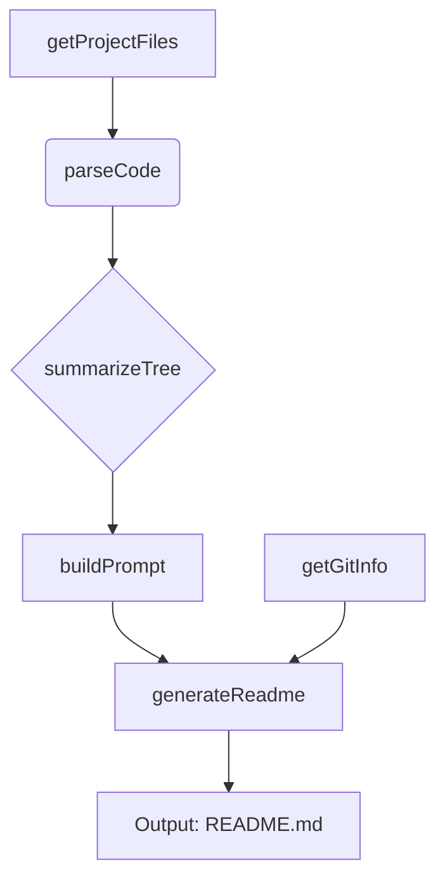
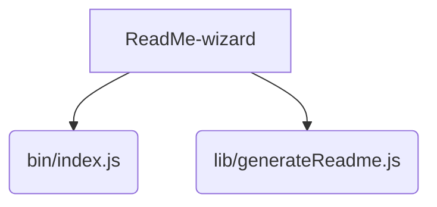

# ReadMe-wizard

> A command-line tool to automatically generate high-quality README.md files for your projects.  Simplifies documentation creation and ensures consistent formatting.

## Description

ReadMe-wizard is a Node.js command-line tool designed to streamline the process of creating professional README files for software projects.  It leverages information extracted from your project's files and codebase to automatically generate a well-structured and comprehensive README.md.  This tool is particularly useful for developers who want to save time and effort on documentation, ensuring consistency across multiple projects.  Core functionality relies on functions like `getGitInfo`, `getProjectFiles`, `parseCode`, `summarizeTree`, `buildPrompt`, `generateReadme`, and `callGemini` (for advanced summarization capabilities, if available). These functions intelligently process project data to produce a polished, informative README.


## Architecture Overview



## File Structure



## Features

* **Automated README Generation:** Creates a structured README.md file based on project data.
* **Code Analysis:** Extracts relevant information from source code files to describe functionality.
* **Project Information Gathering:**  Collects metadata such as project name, author, and file structure.
* **Customizable Templates:** (Future feature) Allows tailoring the generated README to specific project needs.
* **Git Integration:** (Future feature) Leverages Git history to automatically populate sections like "Recent Changes."
* **Intelligent Summarization:** Uses advanced techniques (like Gemini, if available) to concisely describe complex code sections.

## Installation

1. **Prerequisites:** Ensure you have Node.js and npm (or yarn) installed on your system.

2. **Clone the Repository:**

```bash
git clone https://github.com/[your-github-username]/ReadMe-wizard.git
cd ReadMe-wizard
```

3. **Install Dependencies:**

```bash
npm install
```

## Usage

1. Navigate to the directory containing your project.

2. Run ReadMe-wizard, specifying your project's path:

```bash
npx ReadMe-wizard /path/to/your/project
```


## Scripts

* `npm start`: Runs the ReadMe-wizard application.
* `npm test`: Runs the test suite (if implemented).


## Contributing

Contributions are welcome! Please open an issue to report bugs or suggest features.  Pull requests are also appreciated, following standard GitHub workflow and contributing guidelines (to be added).


## License

MIT License

## Credits

* **Author:** PIYUSH1SAINI
* **Dependencies:** Node.js, npm (or yarn)


<a href="https://github.com/PIYUSH1SAINI/ReadMe-wizard.git" target="_blank">

</a>

  