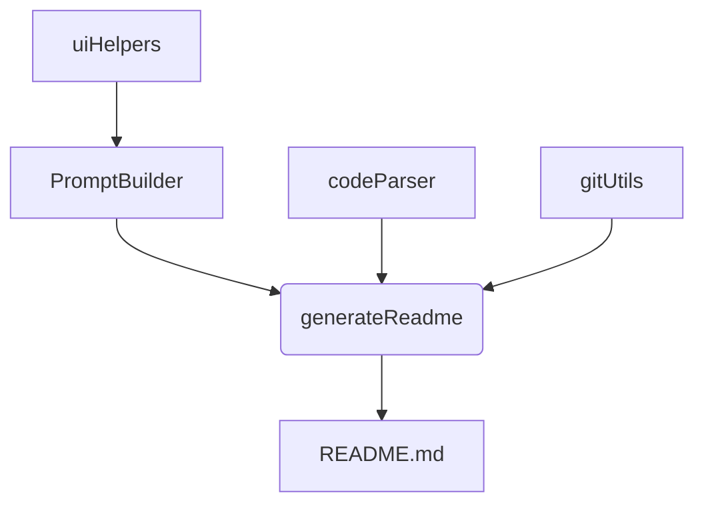
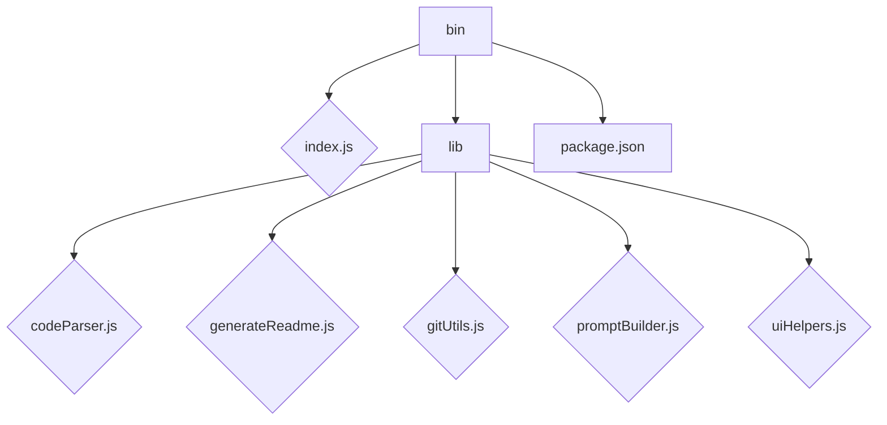

# ReadMe-wizard

> A CLI tool to generate README files for software projects using interactive prompts and code analysis.

## Table of Contents

- [Description](#description)
- [Tech Stack](#tech-stack)
- [Architecture Overview](#architecture-overview)
- [File Structure](#file-structure)
- [Features](#features)
- [Installation](#installation)
  - [Prerequisites](#prerequisites)
  - [Setup](#setup)
- [Usage](#usage)
  - [Execution Options](#execution-options)
    - [Global CLI](#global-cli)
- [Contributing](#contributing)
- [Contributors](#contributors)
- [License](#license)


## Description

ReadMe-wizard is a command-line interface (CLI) tool built with Node.js that simplifies the process of creating comprehensive README files for software projects.  It leverages interactive prompts to gather project information and utilizes code analysis to automatically generate sections such as a project description and features list.  The tool validates Gemini API keys (if provided), ensuring proper configuration before generating the final README.md file. Its primary use case is automating the tedious task of README creation, significantly reducing development overhead.


## Tech Stack

[](https://nodejs.org/)
[](https://www.npmjs.com/package/inquirer)
[](https://www.npmjs.com/package/chalk)
[](https://www.npmjs.com/package/figlet)
[](https://www.npmjs.com/package/fs-extra)
[](https://www.npmjs.com/package/globby)
[](https://www.npmjs.com/package/ora)
[](https://www.npmjs.com/package/prompts)
[](https://www.npmjs.com/package/simple-git)
[](https://github.com/tree-sitter/tree-sitter)
[](https://cloud.google.com/generative-ai)
[](https://github.com/PIYUSH1SAINI/ReadMe-wizard.git)


## Architecture Overview



## File Structure



## Features

*   Interactive prompts for gathering project information.
*   Code analysis to automatically populate README sections.
*   Gemini API key validation for enhanced functionality.
*   Generation of a comprehensive README.md file.
*   Support for various programming languages through tree-sitter integration.
*   User-friendly CLI experience.

## Installation

### Prerequisites

*   Node.js >=14

### Setup

1.  Clone the repository:
    ```bash
    git clone https://github.com/PIYUSH1SAINI/ReadMe-wizard.git
    ```
2.  Navigate to the project directory:
    ```bash
    cd ReadMe-wizard
    ```
3.  Install dependencies:
    ```bash
    npm install
    ```


## Usage

### Execution Options

#### Global CLI

To generate a README file, run the following command:

```bash
make-readme
```

The tool will guide you through a series of interactive prompts to gather the necessary information for your README.


## Contributing

Contributions are welcome! Please open an issue or submit a pull request.

## Contributors

<a href="https://github.com/PIYUSH1SAINI" target="_blank"></a>

## License

MIT License


<a href="https://github.com/PIYUSH1SAINI/ReadMe-wizard.git" target="_blank">
      
    </a>
