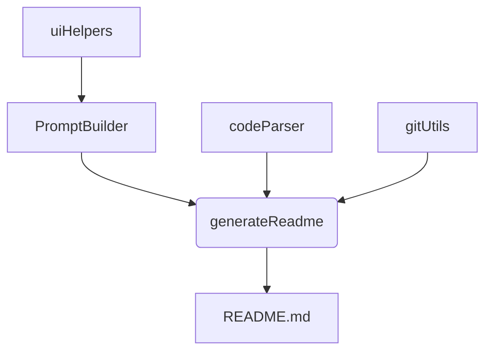
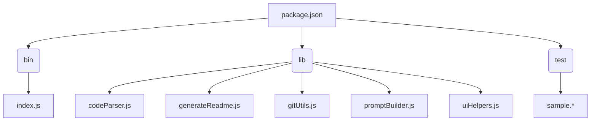

# ReadMe-wiz

> A command-line tool for generating README files. Utilizes code parsing and prompts to create comprehensive documentation.

[](https://www.npmjs.com/package/readme-wiz)
[](https://github.com/PIYUSH1SAINI/ReadMe-wiz)
[](https://www.npmjs.com/package/readme-wiz)
[](https://github.com/PIYUSH1SAINI/ReadMe-wiz)

## 📚 Table of Contents

- [Description](#description)
- [Tech Stack](#tech-stack)
- [Architecture Overview](#architecture-overview)
- [File Structure](#file-structure)
- [Features](#features)
- [Installation](#installation)
- [Usage](#usage)
- [Testing](#testing)
- [Contributors](#contributors)
- [License](#license)

## Description

ReadMe-wiz is a command-line tool designed to simplify the process of generating comprehensive README files for software projects. It leverages code parsing capabilities to extract key information from your project's source code, then uses prompts to gather additional details and generate a polished README.md. The `make-readme` CLI command, defined in the `package.json` file, provides a user-friendly interface for generating READMEs. The tool supports a wide range of programming languages, demonstrated by its ability to parse various file types in the test directory. Key functions like `generateReadme` and `parseCode` highlight its core functionality.

## Tech Stack

[](https://nodejs.org/)
[](https://www.npmjs.com/package/inquirer)
[](https://www.npmjs.com/package/chalk)
[](https://tree-sitter.github.io/)
[](https://cloud.google.com/vertex-ai/generative-ai)
[](https://www.javascript.com/)
[](https://isocpp.org/)
[](https://learn.microsoft.com/en-us/dotnet/csharp/)
[](https://www.w3.org/Style/CSS/)
[](https://go.dev/)
[](https://html.spec.whatwg.org/)
[](https://www.java.com/)
[](https://www.php.net/)
[](https://www.python.org/)
[](https://www.ruby-lang.org/en/)
[](https://www.rust-lang.org/)
[](https://www.typescriptlang.org/)
[](https://vuejs.org/)
[](https://github.com/PIYUSH1SAINI/ReadMe-wiz.git)

## Architecture Overview



## File Structure



## Features

- Parses various programming languages (C++, C#, CSS, Go, HTML, Java, JavaScript, JSX, PHP, Python, Ruby, Rust, TypeScript, TSX, Vue) to extract code information.
- Generates a README.md file based on parsed code and user input.
- Uses prompts to guide the user through the README creation process.
- Utilizes Git integration to fetch contributor information.
- Supports API key validation (for example, `validateGeminiApiKey`).
- Provides a user-friendly CLI interface via `make-readme`.

## Installation

### Prerequisites

> [!NOTE]
> Node.js >=14 is required for compatibility. Ensure you have Node.js and npm installed.

### Setup

1.  **Global CLI Installation**: Install the CLI tool globally.

    ```bash
    npm install -g readme-wiz
    ```

2.  **Clone Repository**: Clone the repository and install dependencies.
    ```bash
    git clone https://github.com/PIYUSH1SAINI/ReadMe-wiz.git
    cd ReadMe-wiz
    npm install
    ```

> [!TIP]
> Use `npm install -g readme-wiz` for the quickest setup.

## Usage

### Execution Options

#### Global CLI

> [!IMPORTANT]
> Ensure that you have cloned the repository and run `npm install` before using the CLI.

To generate a README, simply run:

```bash
make-readme
```

The following options are available:

| Command             | Description                                                                          |
|----------------------|--------------------------------------------------------------------------------------|
| `make-readme`        | Creates a new README file using default settings. Overwrites existing README.       |
| `make-readme --new`  | Creates a completely new README file. Overwrites existing README.                    |
| `make-readme --new "some user requests"` | Creates a new README file incorporating specified user requests. Overwrites existing README. |
| `make-readme "some user requests"` | Updates an existing README file with specified user requests. Creates a new one if none exists. |


## Testing

This project includes a test suite for the multilanguage feature. The tests are located in the `test` folder. To run the tests, execute the following command:

```bash
node runParserTests.js
```

## Contributors

<a href="https://github.com/PIYUSH1SAINI" target="_blank"></a>

## License

MIT License

This software is licensed under the MIT License. See the LICENSE file for details.

<a href="https://github.com/PIYUSH1SAINI/ReadMe-wiz.git" target="_blank">
      
    </a>
