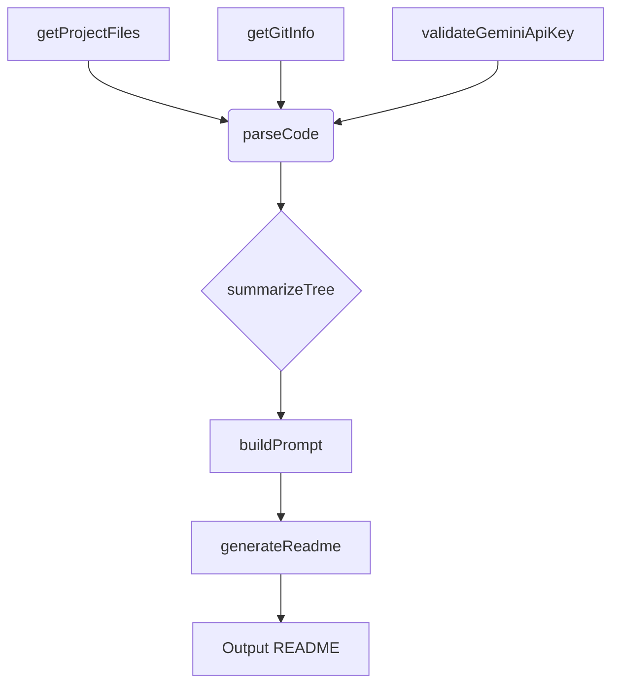
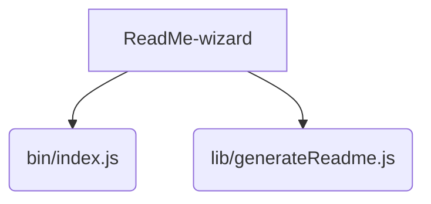

# ReadMe-wizard

> A command-line tool to generate professional README.md files for your projects.  Simplify your documentation workflow.

## Description

ReadMe-wizard is a powerful command-line tool designed to streamline the creation of high-quality README files for software projects.  It leverages information about your project's files and code structure to automatically generate a well-organized and informative README.  The tool utilizes key functions such as `validateGeminiApiKey`, `getGitInfo`, `getProjectFiles`, `parseCode`, `summarizeTree`, `buildPrompt`, and `generateReadme` to gather and process necessary data, resulting in a professional and user-friendly document. This simplifies the often tedious task of manually creating README files, freeing up developers to focus on other aspects of their projects.


## Architecture Overview



## File Structure




## Features

* **Automated README Generation:**  Automatically creates a structured README.md file based on project files and code analysis.
* **Git Integration:** Extracts relevant project information from your Git repository (if available).
* **Code Analysis:** Parses code to identify key functions and classes for inclusion in the README.
* **Customizable Output:**  Allows for customization of the generated README's content and style (future enhancement).
* **API Key Validation:**  (For future expansion) Securely handles API key validation to ensure proper functionality.
* **Project File Analysis:**  Intelligently gathers information from various project files.

## Installation

**Prerequisites:**

* Node.js (version 16 or higher)

**Installation Steps:**

```bash
git clone <repository_url>
cd ReadMe-wizard
npm install
```

## Usage

To generate a README, simply run the following command:

```bash
node bin/index.js
```

This will analyze your project and output a `README.md` file in the current directory.

## Scripts

* `npm start`: Starts the ReadMe-wizard.
* `npm test`: Runs tests (future enhancement).

## Contributing

Contributions are welcome! Please open an issue to report bugs or suggest features.  Pull requests are also greatly appreciated.

## License

MIT License

## Credits

* **Author:** PIYUSH1SAINI
* **Dependencies:** Node.js, npm


<a href="https://github.com/PIYUSH1SAINI/ReadMe-wizard.git" target="_blank">

</a>
