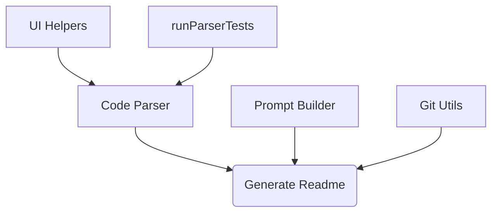
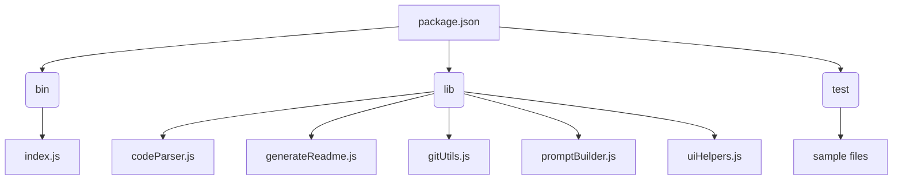

# ReadMe-wizard

> A CLI tool to generate README files for software projects.  Parses code and utilizes AI to generate a comprehensive README.

## Table of Contents

- [Description](#description)
- [Tech Stack](#tech-stack)
- [Architecture Overview](#architecture-overview)
- [File Structure](#file-structure)
- [Features](#features)
- [Installation](#installation)
  - [Prerequisites](#prerequisites)
  - [Setup](#setup)
- [Usage](#usage)
  - [Execution Options](#execution-options)
- [Contributing](#contributing)
- [Contributors](#contributors)
- [License](#license)


## Description

ReadMe-wizard is a command-line tool built with Node.js that automates the creation of comprehensive README files for software projects. It leverages AI through the `@google/generative-ai` library to generate descriptions and summarizes codebases. The tool parses various programming languages (including C++, C#, CSS, Go, HTML, Java, JavaScript, JSX, PHP, Python, Ruby, Rust, TypeScript, and Vue.js) to extract key information, such as functions, classes, and methods.  The generated READMEs are designed to be informative and user-friendly, suitable for both technical and non-technical audiences.  The `make-readme` command from the CLI facilitates the generation of these README files.

## Tech Stack

[](https://nodejs.org/) [](https://www.npmjs.com/package/inquirer) [](https://developers.generativeai.google/) [](https://www.npmjs.com/package/chalk) [](https://github.com/tree-sitter/tree-sitter) [](https://github.com/PIYUSH1SAINI/ReadMe-wizard.git)


## Architecture Overview



## File Structure



## Features

* **Multi-language Support:** Parses code from various languages (C++, C#, CSS, Go, HTML, Java, JavaScript, JSX, PHP, Python, Ruby, Rust, TypeScript, Vue.js).
* **AI-Powered Description Generation:** Leverages AI to create concise and informative project descriptions.
* **Git Integration:** Extracts contributor information and commit counts directly from Git repositories.
* **Interactive Prompts:** Uses Inquirer.js for interactive prompts during README generation.
* **Code Summarization:** Provides a summary of the project's code structure.
* **Customizable Output:** Allows for tailoring the generated README.


## Installation

### Prerequisites

* Node.js >=14

### Setup

1. Clone the repository:
   ```bash
   git clone https://github.com/PIYUSH1SAINI/ReadMe-wizard.git
   ```
2. Navigate to the project directory:
   ```bash
   cd ReadMe-wizard
   ```
3. Install dependencies:
   ```bash
   npm install
   ```

## Usage

### Execution Options

#### Global CLI Execution:

To generate a README, run the following command from your project's root directory (ensure you have installed the package globally using `npm install -g .`):


```bash
make-readme
```

This will prompt you for the necessary information and generate a README.md file.


## Contributing

Contributions are welcome! Please open an issue or submit a pull request.

## Contributors

<a href="https://github.com/PIYUSH1SAINI" target="_blank"></a>

## License

MIT License


<a href="https://github.com/PIYUSH1SAINI/ReadMe-wizard.git" target="_blank">
      
    </a>
