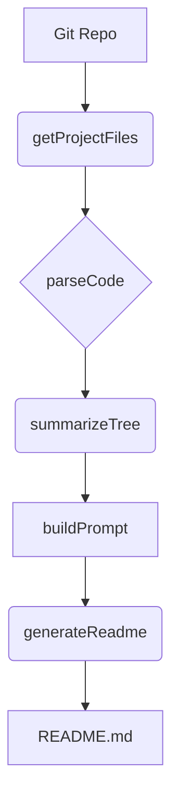
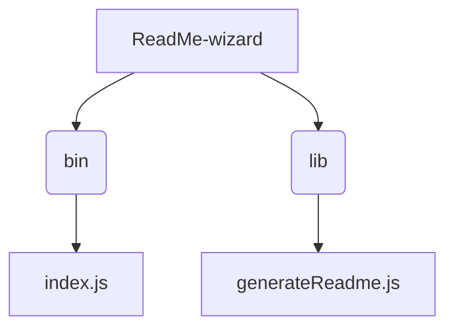

# ReadMe-wizard

> A command-line tool to generate professional, user-friendly README files for software projects.  Quickly create well-structured READMEs with essential information.

## Description

ReadMe-wizard is a command-line tool designed to simplify the creation of high-quality README files for software projects. It automates the process of gathering project information, structuring content, and generating a polished README.md file.  The tool utilizes several key functions: `getGitInfo` retrieves project metadata from Git, `getProjectFiles` analyzes the project's file structure, `parseCode` extracts information from source code (e.g., function signatures), `summarizeTree` provides a concise summary of the project's structure, `buildPrompt` creates interactive prompts for user input, `generateReadme` assembles the README content, and `callGemini` potentially leverages external AI assistance for content generation. This streamlines the README creation process, saving developers valuable time and effort.


## Architecture Overview



## File Structure




## Features

* **Automated Project Information Gathering:** Collects essential project details from Git repositories and the project's file structure.
* **Structured README Generation:** Creates a well-organized README.md file with sections for description, installation, usage, and more.
* **Code Analysis:** Extracts key information from source code to enhance the README's content.
* **Interactive Prompts:** Guides users through a series of prompts to gather necessary information and customize the README.
* **Customizable Templates:** Allows users to tailor the output to match their project's specific needs.
* **Extensible Design:**  Easily adaptable to different project types and programming languages.


## Installation

**Prerequisites:**

* Node.js (v16 or higher)

**Installation Steps:**

```bash
git clone https://github.com/[YourGitHubUsername]/ReadMe-wizard.git
cd ReadMe-wizard
npm install
```

## Usage

To generate a README, simply run:

```bash
node bin/index.js
```

The tool will then guide you through a series of interactive prompts to gather information about your project.


## Scripts

* `npm start`: Runs the ReadMe-wizard application.
* `npm test`: Runs unit tests for the application. (If applicable)


## Contributing

We welcome contributions to ReadMe-wizard! Please feel free to open issues or submit pull requests on GitHub.  Before contributing, please read our [CONTRIBUTING.md](CONTRIBUTING.md) file (to be created).

## License

MIT License

Copyright (c) 2023 PIYUSH1SAINI

Permission is hereby granted, free of charge, to any person obtaining a copy
of this software and associated documentation files (the "Software"), to deal
in the Software without restriction, including without limitation the rights
to use, copy, modify, merge, publish, distribute, sublicense, and/or sell
copies of the Software, and to permit persons to whom the Software is
furnished to do so, subject to the following conditions:

The above copyright notice and this permission notice shall be included in all
copies or substantial portions of the Software.

THE SOFTWARE IS PROVIDED "AS IS", WITHOUT WARRANTY OF ANY KIND, EXPRESS OR
IMPLIED, INCLUDING BUT NOT LIMITED TO THE WARRANTIES OF MERCHANTABILITY,
FITNESS FOR A PARTICULAR PURPOSE AND NONINFRINGEMENT. IN NO EVENT SHALL THE
AUTHORS OR COPYRIGHT HOLDERS BE LIABLE FOR ANY CLAIM, DAMAGES OR OTHER
LIABILITY, WHETHER IN AN ACTION OF CONTRACT, TORT OR OTHERWISE, ARISING FROM,
OUT OF OR IN CONNECTION WITH THE SOFTWARE OR THE USE OR OTHER DEALINGS IN THE
SOFTWARE.


## Credits

* **Author:** PIYUSH1SAINI
* **Dependencies:** Node.js, npm (potentially others depending on implementation)


<a href="https://github.com/PIYUSH1SAINI/ReadMe-wizard.git" target="_blank">

</a>

  