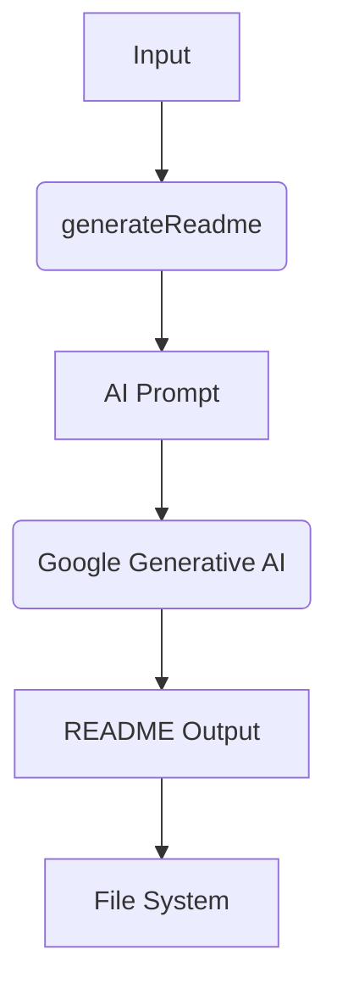
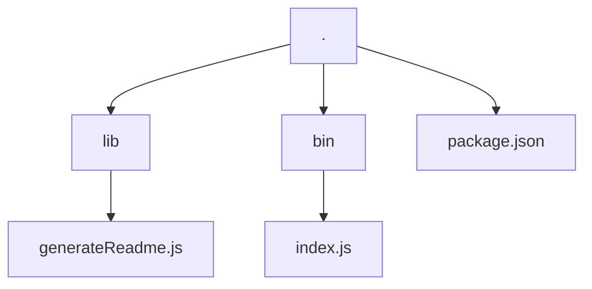

# ReadMe-wizard

> A CLI tool for generating professional README files using AI.  Effortlessly create comprehensive documentation for your projects.

## Table of Contents

- [Description](#description)
- [Tech Stack](#tech-stack)
- [Architecture Overview](#architecture-overview)
- [File Structure](#file-structure)
- [Features](#features)
- [Installation](#installation)
- [Usage](#usage)
- [Contributing](#contributing)
- [License](#license)
- [Credits](#credits)


## Description

ReadMe-wizard is a command-line interface (CLI) tool designed to automate the creation of high-quality README files for software projects. Leveraging the power of Google's Generative AI, it guides you through an interactive process to gather project information and intelligently generates a comprehensive README.  The tool utilizes functions such as `validateGeminiApiKey` for secure API access and `buildPrompt` for crafting effective prompts for the AI model, ensuring accurate and relevant documentation.  Using the `make-readme` command (defined in `package.json`), you can quickly generate a well-structured README, enhancing your project's clarity and professionalism.

## Tech Stack

[](https://nodejs.org/) [](https://cloud.google.com/generative-ai) [](https://github.com/chalk/chalk) [](https://github.com/motdotd/dotenv) [](https://github.com/patorjk/figlet) [](https://github.com/jprichardson/node-fs-extra) [](https://github.com/sindresorhus/globby) [](https://github.com/enquirer/enquirer) [](https://github.com/sindresorhus/ora) [](https://github.com/terkelg/prompts) [](https://github.com/steveukx/git-js) [](https://github.com/tree-sitter/tree-sitter) [](https://github.com/tree-sitter/tree-sitter-javascript) [](https://github.com/PIYUSH1SAINI/ReadMe-wizard.git)


## Architecture Overview



## File Structure



## Features

*   Generates README files using AI-powered content generation.
*   Interactive CLI experience using Inquirer for user input.
*   Parses code using Tree-sitter for code-related insights in the README.
*   Uses Figlet to display ASCII art enhancing the user experience.
*   Provides real-time feedback and progress updates using Ora.
*   Integrates with Git to fetch project information.


## Installation

### Prerequisites

```bash
node >=14
npm
```

### Setup

1.  Clone the repository:
    ```bash
    git clone https://github.com/PIYUSH1SAINI/ReadMe-wizard.git
    cd ReadMe-wizard
    ```
2.  Install dependencies:
    ```bash
    npm install
    ```

### Installation Options

#### Production (Global)

```bash
npm install -g .
```

#### Development (Local)

```bash
npm link
```

Complete Setup steps first, then choose one installation option.


## Usage

### Execution Options

#### Run Locally

```bash
node lib/generateReadme.js
```

For testing without global installation.

#### Run Globally

```bash
make-readme
```

Requires global installation.


## Contributing

Contributions are welcome! Please open an issue or submit a pull request.


## License

MIT License

## Credits

PIYUSH1SAINI

@google/genai, @google/generative-ai, chalk, dotenv, figlet, fs-extra, globby, inquirer, ora, prompts, simple-git, tree-sitter, tree-sitter-javascript

    

<a href="https://github.com/PIYUSH1SAINI/ReadMe-wizard.git" target="_blank">
    
    </a>
