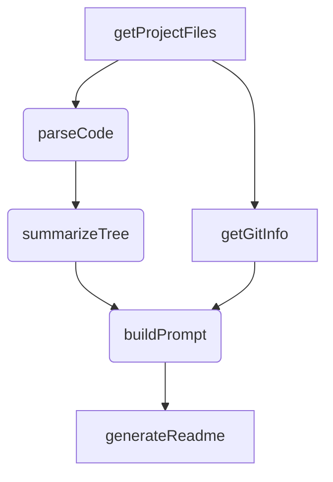
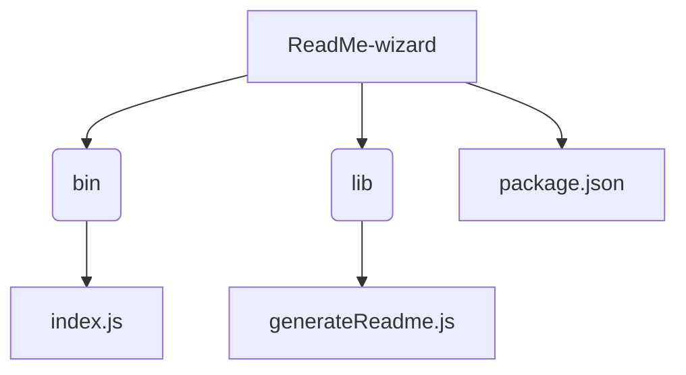

# ReadMe-wizard

> A CLI tool for generating professional READMEs using AI, powered by Google Generative AI.  Easily create comprehensive documentation with interactive prompts and code analysis.

## Table of Contents

- [Description](#description)
- [Tech Stack](#tech-stack)
- [Architecture Overview](#architecture-overview)
- [File Structure](#file-structure)
- [Features](#features)
- [Installation](#installation)
- [Usage](#usage)
- [Scripts](#scripts)
- [Contributing](#contributing)
- [License](#license)
- [Credits](#credits)


## Description

ReadMe-wizard is a command-line interface (CLI) tool designed to streamline the process of creating high-quality README files for software projects. It leverages Google Generative AI to generate comprehensive documentation based on your project's codebase and interactive prompts.  The tool offers an interactive setup experience enhanced with ASCII art and real-time feedback, ensuring a user-friendly and efficient workflow. Key features include automatic extraction of project information via `getGitInfo` and code parsing with `parseCode`, followed by the creation of a compelling prompt using `buildPrompt` for the AI model, and ultimately, generating the README using `generateReadme`. The `validateGeminiApiKey` function ensures proper authentication with the Gemini AI API.  The `make-readme` command, defined in the `package.json` file, provides convenient access to the CLI functionality.

## Tech Stack

[](https://nodejs.org/) [](https://cloud.google.com/generative-ai) [](https://www.npmjs.com/package/simple-git) [](https://github.com/tree-sitter/tree-sitter) [](https://github.com/chalk/chalk) [](https://www.npmjs.com/package/figlet) [](https://www.npmjs.com/package/inquirer) [](https://www.npmjs.com/package/ora) [](https://www.npmjs.com/package/fs-extra) [](https://www.npmjs.com/package/globby) [](https://www.npmjs.com/package/dotenv) [](https://www.npmjs.com/package/prompts) [](https://github.com/PIYUSH1SAINI/ReadMe-wizard.git)


## Architecture Overview



## File Structure



## Features

*   Generates READMEs using Google Generative AI.
*   Interactive setup with Inquirer for customizable prompts.
*   Parses project files using Tree-sitter for code analysis.
*   Includes ASCII art using Figlet for a visually appealing experience.
*   Provides real-time feedback during the generation process using Ora.
*   Integrates with Git repositories using Simple Git to extract project information.


## Installation

### Prerequisites

```bash
# Ensure Node.js >=14 is installed.  Check with:
node -v
```

### Setup

```bash
# Clone the repository:
git clone https://github.com/PIYUSH1SAINI/ReadMe-wizard.git
cd ReadMe-wizard
# Install dependencies:
npm install
```

### Installation Options

#### Production (Global)

```bash
npm install -g .
```

#### Development (Local)

```bash
npm link
```
Complete Setup steps first, then choose one installation option.


## Usage

### Execution Options

#### Run Locally

```bash
node lib/generateReadme.js
```
For testing without global installation.


#### Run Globally

```bash
make-readme
```
This requires global installation (see Production Installation above).


## Scripts

```bash
{
  "test": "echo \"Error: no test specified\" && exit 1"
}
```

## Contributing

Contributions are welcome! Please open an issue or submit a pull request.

## License

MIT License

## Credits

PIYUSH1SAINI

@google/genai, @google/generative-ai, chalk, dotenv, figlet, fs-extra, globby, inquirer, ora, prompts, simple-git, tree-sitter, tree-sitter-javascript

    

<a href="https://github.com/PIYUSH1SAINI/ReadMe-wizard.git" target="_blank">
    
    </a>
