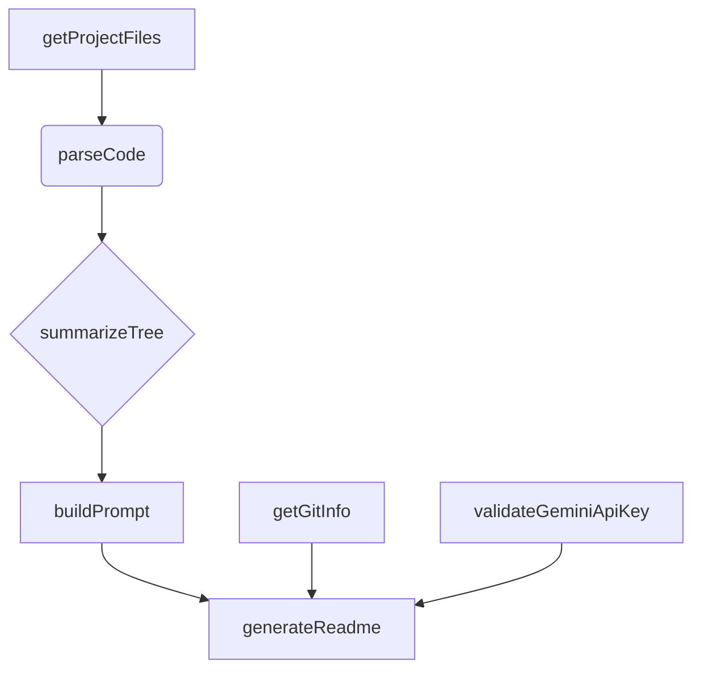
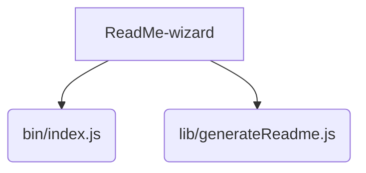

# ReadMe-wizard

> A tool to generate professional, user-friendly README files for software projects.  Simplify your documentation process.

## Description

ReadMe-wizard is a command-line tool designed to automate the creation of high-quality README files for software projects.  It streamlines the documentation process by leveraging project metadata and code analysis to generate a comprehensive and well-structured README.  The tool's core functionality relies on functions such as `validateGeminiApiKey`, `getGitInfo`, `getProjectFiles`, `parseCode`, `summarizeTree`, `buildPrompt`, and `generateReadme` within `lib/generateReadme.js`. These functions work together to gather project information, analyze the codebase, and produce a polished README.md file tailored to your project.  This significantly reduces the time and effort required for creating professional documentation.

## Architecture Overview



## File Structure



## Features

* **Automated README Generation:** Creates comprehensive README files based on project code and metadata.
* **Code Analysis:** Parses code to extract key information for inclusion in the README.
* **Git Integration:** Retrieves relevant project information from your Git repository.
* **Customizable Templates:** (Future feature) Allows tailoring the generated README to specific project needs.
* **API Key Validation:** (Future feature) Ensures API keys are valid before use.
* **Project Summary:** Provides a concise overview of the project's purpose and functionality.

## Installation

Ensure you have Node.js and npm (or yarn) installed on your system.

```bash
# Clone the repository
git clone <repository_url>
cd ReadMe-wizard

# Install dependencies
npm install
```

## Usage

```bash
# Generate a README file for the current directory
npx ReadMe-wizard

# Generate a README file for a specific directory (optional)
npx ReadMe-wizard /path/to/project
```

## Scripts

* `npm start`: Runs the ReadMe-wizard.
* `npm test`: Runs the test suite. (Future Feature)


## Contributing

We welcome contributions! Please open an issue or submit a pull request.


## License

MIT License

## Credits

* PIYUSH1SAINI


<a href="https://github.com/PIYUSH1SAINI/ReadMe-wizard.git" target="_blank">

</a>
