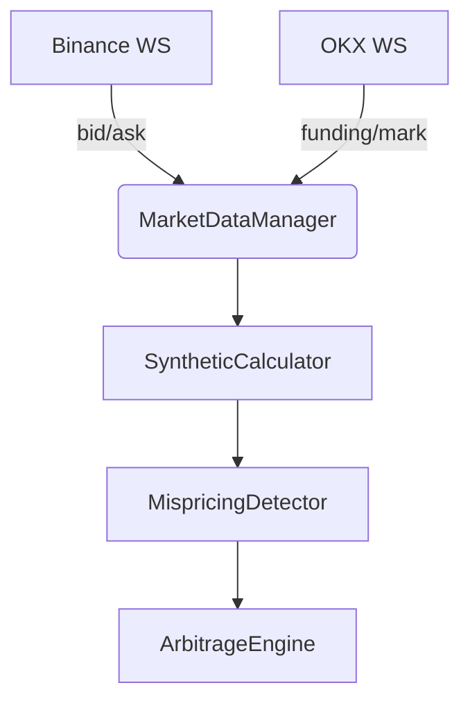

# ⚡ GoQuant Arbitrage Engine

> Real-time cross-exchange arbitrage engine for spot & derivatives trading


## 📚 Table of Contents

- [⚙️ Features & Status](#️-features--status)
- [🧱 Project Structure](#-project-structure)
- [🧪 Module-by-Module Overview](#-module-by-module-status-overview)
- [📈 Recent Achievements & Changes](#-recent-achievements--changes)
- [🚀 Build & Run](#-build--run)
- [🧾 Expected Output](#-expected-output)
- [🧠 Architecture Overview](#-architecture-overview)
- [🎥 Demo](#-demo)
- [🤝 Contributing](#-contributing)
- [🛣 Roadmap](#-roadmap)
- [📄 License](#-license)

---

## ⚙️ Features & Status

| Feature                       | Status     | Description                                                                                                                                                                                                                                               |
| ----------------------------- | ---------- | --------------------------------------------------------------------------------------------------------------------------------------------------------------------------------------------------------------------------------------------------------- |
| ✅ **BinanceConnector**       | Complete   | - Fully integrated with Binance WebSocket: <br> - Spot L2 <br> - Perp L2 <br> - Mark Price <br> - Funding Rate <br> - Robust, multi-threaded, handles all JSON edge cases <br> - Logs and updates best bid/ask, mark price, and funding rate in real time |
| ✅ **OKXConnector**           | Complete   | - Fully integrated with OKX WebSocket: <br> - Books <br> - Mark Price <br> - Funding Rate <br> - Robust symbol normalization and API compliance <br> - Real-time orderbook, mark price, and funding rate updates                                          |
| 🚧 **BybitConnector**         | Incomplete | - Scaffold present <br> - Live integration not yet implemented                                                                                                                                                                                            |
| ✅ **MarketDataManager**      | Complete   | - Thread-safe storage and retrieval of best bid/ask, mark price, and funding rate <br> - Consistent symbol normalization across all exchanges <br> - Shared data manager used by all connectors                                                           |
| ✅ **SyntheticCalculator**    | Working    | - Synthetic spot calculation from OKX perpetual mark price and funding rate <br> - Real-time computation using funding rate and next funding time <br> - Compares Binance spot mid-price vs. OKX synthetic spot                                           |
| ✅ **MispricingDetector**     | Working    | - Cross-exchange arbitrage detection between Binance and OKX <br> - Real-time detection of price differences exceeding threshold (configurable) <br> - Logs arbitrage opportunities with source/destination and amounts                                   |
| ✅ **ArbitrageEngine**        | Working    | - Detects and logs real arbitrage opportunities <br> - Integrated with TradeExecutor for simulated (dry-run) and live trading                                                                                                                             |
| ⚠️ **RiskManager**            | Dummy      | - Dummy logic for position sizing, funding cost, exposure <br> - Needs advanced models                                                                                                                                                                    |
| ✅ **PerformanceMonitor**     | Complete   | - Logs latency, throughput, memory, and CPU usage                                                                                                                                                                                                         |
| ✅ **Unit Testing**           | Complete   | - Google Test suite covers all major modules <br> - All tests passing (including thread safety)                                                                                                                                                           |
| ✅ **Shutdown Handling**      | Complete   | - Signal handling and clean exit supported                                                                                                                                                                                                                |
| ✅ **Config Handling**        | Complete   | - JSON config file and CLI argument parsing <br> - Thread-safe, globally accessible ConfigManager <br> - All modules use config values (no hardcoded parameters)                                                                                          |
| ✅ **Multi-Symbol Support**   | Complete   | - Cross-exchange arbitrage between multiple symbols <br> - Real-time data feeds from both exchanges <br> - Easy extension to additional symbols and exchanges                                                                                             |
| ✅ **Multi-Exchange Support** | Working    | - Binance + OKX fully integrated and working                                                                                                                                                                                                              |
| 🟡 **Documentation**          | Partial    | - Needs more detail, diagrams, architecture docs                                                                                                                                                                                                          |

---

## 🧱 Project Structure

| Folder / File      | Description                                               |
| ------------------ | --------------------------------------------------------- |
| `src/`, `include/` | All core engine, exchange, and utility code               |
| `third_party/`     | External dependencies (Asio, nlohmann/json, spdlog, etc.) |
| `tests/`           | Google Test suite for core modules                        |
| `CMakeLists.txt`   | Modern CMake setup (Boost, OpenSSL, spdlog integration)   |
| `README.md`        | Project overview, setup instructions, and roadmap         |

---

## 🧪 Module-by-Module Status Overview

| Module                     | Status        | Notes                                                        |
| -------------------------- | ------------- | ------------------------------------------------------------ |
| **BinanceConnector**       | ✅ Complete   | Live L2, mark price, funding feeds; production-grade         |
| **OKXConnector**           | ✅ Complete   | Live books, mark-price, funding-rate feeds; production-grade |
| **BybitConnector**         | 🚧 Incomplete | Only scaffold; no live integration yet                       |
| **MarketDataManager**      | ✅ Complete   | Thread-safe, shared data manager with symbol normalization   |
| **SyntheticCalculator**    | ✅ Working    | Real synthetic spot calculation from OKX perp data           |
| **MispricingDetector**     | ✅ Working    | Real cross-exchange arbitrage detection (Binance vs OKX)     |
| **ArbitrageEngine**        | ✅ Working    | Detects and logs real arbitrage opportunities                |
| **TradeExecutor**          | ✅ Working    | Simulated (dry-run) and live trade execution, REST API, risk |
| **RiskManager**            | ⚠️ Dummy      | Requires real models (exposure, funding cost, VaR)           |
| **PerformanceMonitor**     | ✅ Complete   | Logs latency, memory, CPU, throughput                        |
| **Config Handling**        | ✅ Complete   | JSON config file and CLI parsing, thread-safe, global access |
| **Unit Testing**           | ✅ Complete   | Covers all major modules, including config/thread safety     |
| **Shutdown Handling**      | ✅ Complete   | Signal-safe shutdown                                         |
| **Multi-Symbol Support**   | ✅ Complete   | BTCUSDT/ETHUSDT/SOLUSDT working; easy extension              |
| **Multi-Exchange Support** | ✅ Working    | Binance + OKX fully integrated and working                   |
| **Documentation**          | 🟡 Partial    | Needs more detail, diagrams, architecture docs               |

---

## 📈 Recent Achievements & Changes

### ✅ Config Refactor & Thread Safety

- Replaced hardcoded config with a robust, thread-safe, globally accessible `ConfigManager`.
- Added support for loading config from `config.json` and overriding via CLI arguments.
- All modules now use config values (API keys, symbols, thresholds, etc.) from the config manager.
- Fixed a critical deadlock bug in config access by switching to `std::recursive_mutex`.
- Unit tests for config and thread safety now pass.

### ✅ Trade Execution Pipeline

- Integrated `TradeExecutor` with REST API connectors for Binance and OKX.
- Supports both dry-run (simulated) and live trading modes.
- Risk checks and logging for all trade attempts.

### ✅ Production-Grade Reliability

- No more infinite loops or deadlocks at startup or in tests.
- Robust error handling, reconnection, and data validation.
- Clean shutdown on interrupt.

---

## 🚀 Build & Run

**Requirements:**

- CMake 3.20+
- C++20-compatible compiler
- Dependencies: Boost, OpenSSL, nlohmann/json, spdlog  
  (Install via Homebrew or vcpkg)
- Standalone Asio (vendored in `third_party/asio`)

**Build Steps:**

```sh
mkdir -p build
cd build
cmake ..
make -j
```

**Run:**

```sh
./goquant [--config config.json] [--dry-run] [other CLI options]
```

- Loads configuration from `config.json` (or file specified via `--config`).
- All engine parameters (API keys, symbols, thresholds, etc.) are now configurable.
- Connects to Binance and OKX, logs best bid/ask and mark price for all enabled symbols in real time.
- Detects and logs arbitrage opportunities between Binance spot and OKX synthetic spot.
- Press CTRL+C to exit cleanly.

---

## 🧾 Expected Output

```
[info] [main] GoQuant process started
[info] [ConfigManager] Current configuration:
{ ... full config ... }
[info] Connected to OKX SWAP mark-price for BTC-USDT-SWAP
[info] Connected to OKX SWAP funding-rate for BTC-USDT-SWAP
[info] OKX mark price update [btcusdtswap]: 108085.2
[info] OKX funding rate update [btcusdtswap]: 7.273546296e-06
[info] [DEBUG] markPrice: 108087.7, fundingRate: 7.273546296e-06
[info] [DEBUG] Computed Synthetic Spot: 108087.3216504467
[info] [Arb] Binance spot mid: 108101.535 vs. Synthetic spot: 108087.3216504467 | delta: 0.0131%
```

---

## 🧠 Architecture Overview



---

## 🤝 Contributing

We welcome contributions! Here’s how you can help:

- Fork the repo
- Create a feature branch
- Submit a pull request

See `CONTRIBUTING.md` for more details.

---

## 🛣 Roadmap

- [x] Binance spot integration
- [x] OKX synthetic spot pricing
- [ ] Bybit integration
- [ ] Telegram/Slack notification on arbitrage
- [ ] Advanced risk management

---

## 📄 License

MIT
